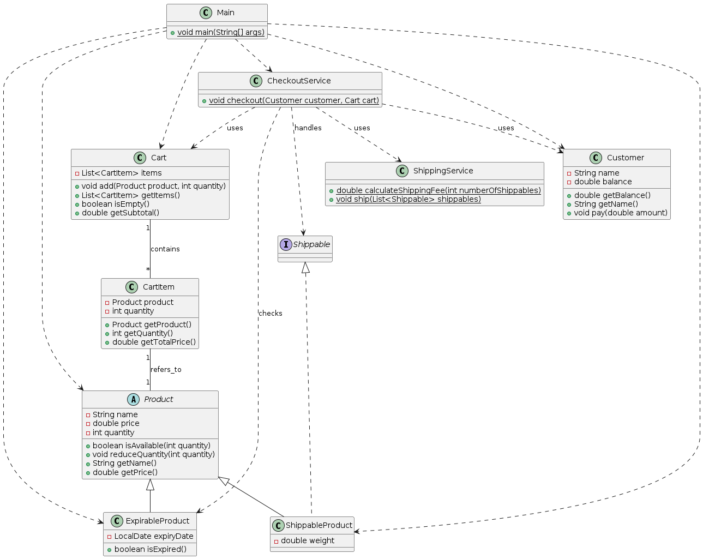

# Fawry Internship Challenge

This repository contains a Java project developed as part of the Fawry Internship Challenge. The project simulates a basic e-commerce checkout system, demonstrating object-oriented programming principles and handling different types of products and services.

## Table of Contents

- [Features](#features)
- [Project Structure](#project-structure)
- [How to Run](#how-to-run)
- [Classes Overview](#classes-overview)
- [UML Diagram](#uml-diagram)
- [Contributing](#contributing)
- [License](#license)

## Features

- **Shopping Cart Management**: Add various products to a customer's cart.
- **Product Types**: Handles regular products, expirable products, and shippable products.
- **Checkout Process**: Simulates a checkout process, including payment and shipping.
- **Error Handling**: Basic error handling for insufficient funds or product unavailability.

## Project Structure

The project is organized into several Java classes, each responsible for a specific part of the e-commerce system.

```
FawryInternshipChallenge/
├── Cart.java
├── CartItem.java
├── CheckoutService.java
├── Customer.java
├── ExpirableProduct.java
├── Main.java
├── Product.java
├── Shippable.java
├── ShippableProduct.java
└── ShippingService.java
```

## How to Run

To compile and run this project, you will need a Java Development Kit (JDK) installed on your system.

1.  **Clone the repository:**

    ```bash
    git clone https://github.com/Farouk-Osman/FawryInternshipChallenge.git
    cd FawryInternshipChallenge
    ```

2.  **Compile the Java files:**

    ```bash
    javac *.java
    ```

3.  **Run the `Main` class:**

    ```bash
    java Main
    ```

    The `Main` class contains a simple demonstration of the system's functionality.

## Classes Overview

Here's a brief description of each Java class in the project:

-   `Cart.java`: Manages the collection of `CartItem` objects, allowing products to be added and retrieved.
-   `CartItem.java`: Represents an item within the shopping cart, holding a `Product` and its quantity.
-   `CheckoutService.java`: Handles the checkout logic, processing payments and initiating shipping for shippable products.
-   `Customer.java`: Represents a customer with a name and available balance.
-   `ExpirableProduct.java`: Extends `Product` to include an expiration date, ensuring products are valid at checkout.
-   `Main.java`: The entry point of the application, demonstrating how to use the various classes to simulate a shopping and checkout experience.
-   `Product.java`: The base class for all products, defining common attributes like name, price, and quantity.
-   `Shippable.java`: An interface defining the contract for products that can be shipped.
-   `ShippableProduct.java`: Extends `Product` and implements `Shippable`, adding weight as an attribute for shipping calculations.
-   `ShippingService.java`: Provides a service for calculating shipping costs based on product weight.

## UML Diagram



## Contributing

Feel free to fork this repository, submit pull requests, or report issues. Contributions are welcome!

## License

This project is open-source and available under the [MIT License](LICENSE).

